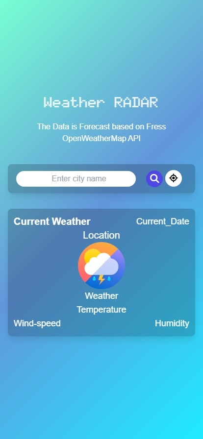
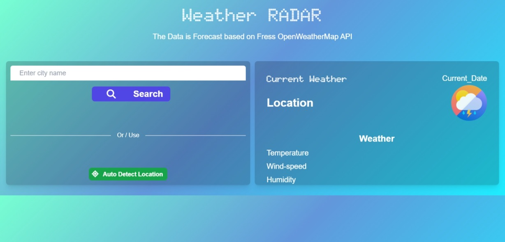
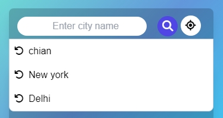
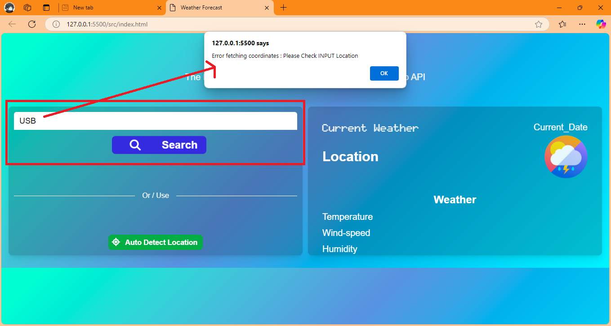
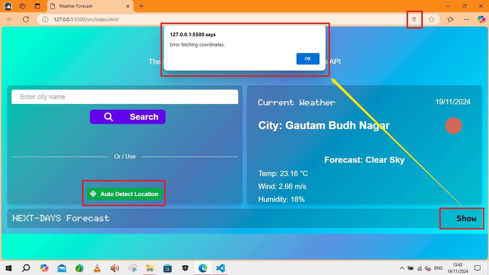
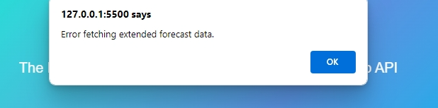

>pre-requirement: active internet connection
## Weather-Forecast-Application: Weather RADAR

# Live Page :[(https://sourabh-969.github.io/Weather-Forecast-Application/](https://sourabh-969.github.io/Weather-Application/))

# Weather Application

This is a simple weather application that allows users to search for weather forecasts by city name or get the weather for their current location. It displays current weather conditions and a 6-day forecast.

## Features

- Responsiveness across screens
 
    
  
- Search for weather by city name or Get weather for current location
 
     
  
- Display current weather conditions (temperature, description, humidity, wind speed)
 
    
  
- Show 5-day weather forecast
 
     
  
- Recent searches dropdown

 
    
  
- Error handling for invalid locations or API errors

 
    
  
    
  
    

## Setup Instructions

1. Clone this repository to your local machine.
2. Open the `index.html` file in a web browser.

> Note: If you're running the app locally, you may need to use a local server due to CORS restrictions when making API calls. You can use tools like Live Server in Visual Studio Code or Python's `http.server`.

3. Make sure you have an active internet connection to fetch weather data from the API.

## Usage

1. Enter a city name in the input field and click the "Search" button or press Enter to get the weather forecast.
2. Click the "Current" button to get the weather forecast for your current location (requires location permissions).
3. Use the "Recently Searched Cities" dropdown to quickly access weather information for previously searched locations.
4. View the current weather conditions and 5-day forecast displayed on the page.

## API Used

This application uses the Weather API from openweatherAPI. You'll need to sign up for a openweatherAPI account and subscribe to the Weather API to get your own API key if you want to modify or extend the application.

## Technologies Used

- HTML5
- CSS3 [with Tailwind CSS utility classes](https://tailwindcss.com/docs/installation)
    >Custom Font by goolge ADDED [fonts.google](https://fonts.google.com/specimen/Doto?query=doto)
    >icon library and toolkit used by ([fontawesome](https://fontawesome.com/))
- JavaScript (ES6+)
- Weather API [via openweatherAPI](https://openweathermap.org/)

## Note

The API key included in the code is for demonstration purposes only. In a production environment, you should never expose your API keys in client-side code. Instead, use environment variables or a backend service to secure your API keys.

